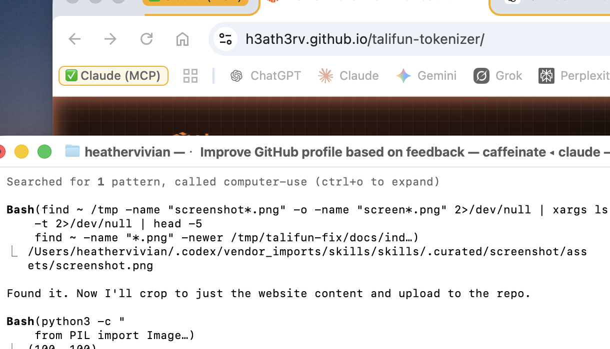

# Talifun Tokenizer

Technical product landing page for a high-performance tokenizer.



## Overview

Talifun Tokenizer is a premium product landing page for a tokenizer performance story. It turns updated o200k benchmark data across Node.js, Python and Rust into a clear, visual narrative for technical buyers, investors and product stakeholders.

The experience is designed to make the product feel fast, credible and easy to understand at a glance.

## My role

- UI direction
- Visual design
- Front-end implementation
- Benchmark storytelling
- AI-assisted workflow and build strategy

## Key features

- Responsive benchmark-led landing page
- High-contrast hero with animated throughput and latency cards
- Data visualization for runtime comparisons
- Embedded launch video with fullscreen playback
- Hugging Face leaderboard pathway
- Dark/light theme support
- SEO and social preview metadata
- Static GitHub Pages deployment output

## Benchmark snapshot

- Node.js throughput: Talifun at 928.39 MB/s
- Python throughput: Talifun at 832.65 MB/s
- Rust throughput: Talifun at 943.20 MB/s
- Lowest measured p99 latency: 0.23 ms in the Rust benchmark set

## Design decisions

- Chose a dark, high-contrast interface to create a premium technical feel.
- Used large type, restrained colour and spacing to keep the experience calm and focused.
- Structured the UI around quick scanning, clear CTAs and mobile readability.
- Used benchmark cards as the main storytelling device so the product value is visible immediately.

## Tech stack

React, Vite, TypeScript, Tailwind CSS, Framer Motion, Lucide React.

## Live demo

[View project](https://h3ath3rv.github.io/talifun-tokenizer/)

## Local development

```bash
npm install
npm run dev
```

## Production build

```bash
npm run build
```

## GitHub Pages build

```bash
npm run build:pages
```
